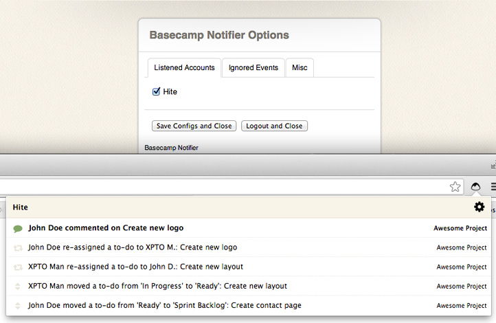

# Basecamp Chrome Notifier V 1.4.0

Extension for Google Chrome which notifies the activity in your Basecamp Accounts with desktop notifications.

Feel free to help us improve the extension.

**[Extension on Chrome Store](https://chrome.google.com/webstore/detail/basecamp-notifier/fihjmkangcncdhnbnenfipalmcegljii)**



##Instructions

In order to run this project you need **[Bower](http://github.com/bower/bower)** to manage the dependencies, for install Bower use:

```npm install -g bower```

and then, inside projects folder:

```bower install```

You also need register an app in **[http://integrate.37signals.com](http://integrate.37signals.com)**  and put the app infos into `js/config_keys.js`, follow the exemple inside `js/config_keys.js.default`.

## Tests

To run the test suite you need run the specs inside Chrome because the Chrome Extension API, for this, when you [install the extension in unpacked mode](http://superuser.com/a/247654/235416) access: 

`chrome-extension://<you-chrome-extension-id>/spec_runner.html`.

## To-do
**[In issues =D](https://github.com/samuelsimoes/Chrome-Basecamp-Notifier/issues?state=open)**

-----------------------------------------

**Samuel Simões ~ [@samuelsimoes](https://twitter.com/samuelsimoes) ~ [samuelsimoes.com](http://samuelsimoes.com)**
